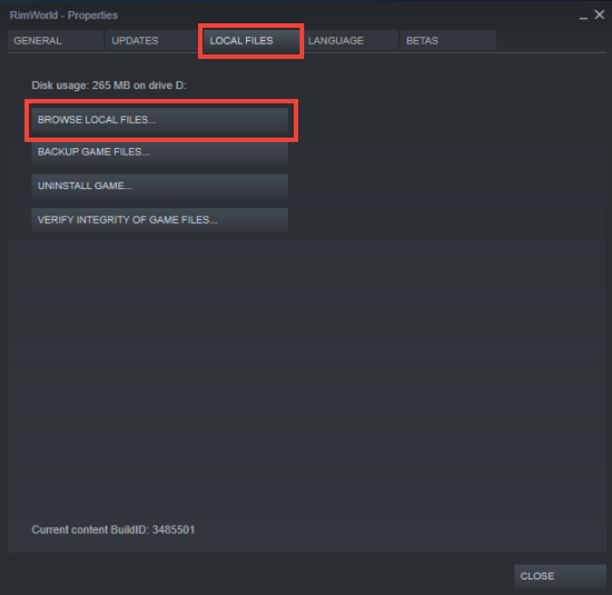
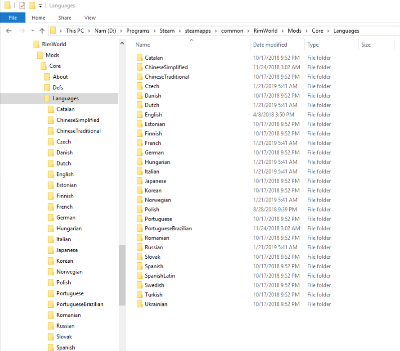
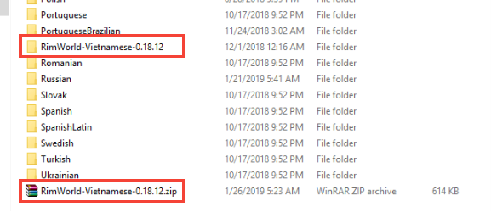
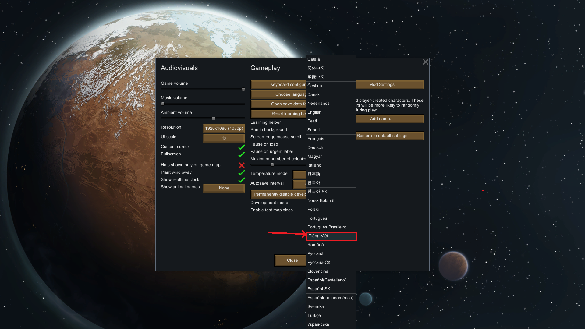

# RimWorld Vietnamese
This is Vietnamese translation data for RimWorld.

### 1. Install this translation (Hướng dẫn cài đặt bản dịch)

Các bạn làm theo các bước sau để có thể sử dụng được bản dịch chưa chính thức này:

#### Cách 1: Không sử dụng git

- B1: Tải về bản dịch mới nhất dưới dạng file nén:
    - zip: [Click để tải xuống](https://github.com/Ludeon/RimWorld-Vietnamese/archive/v0.19.1.zip)
    - tar (dành cho linux): [Click để tải xuống](https://github.com/Ludeon/RimWorld-Vietnamese/archive/v0.19.1.zip)
    - [Hoặc click vào đây để xem chi tiết các phiên bản](https://github.com/Ludeon/RimWorld-Vietnamese/releases/)

- B2: Tìm đến thư mục ngôn ngữ của Rimworld:
    - Mặc định sẽ là: <br>\<steampath\>\steamapps\common\RimWorld\Mods\Core\Languages<br>trong đó \<steampath\> là thư mục cài đặt Steam
    - Cách khác để tìm đến thư mục ngôn ngữ:<br>Mở Steam -> Chọn thẻ Library -> Tìm đến game Rimworld -> Bấm chuột phải vào tên Rimworld -> Chọn Properties<br><br>Ở cửa sổ Rimworld - Properties vừa mở: Chuyển sang thẻ Local Files -> Chọn Browse Local Files...<br><br>Sau bước này thư mục Rimworld sẽ hiện ra, tiếp tục tìm đến \Mods\Core\Languages

- B3: Giải nén file đã tải vào thư mục ngôn ngữ:
    - Sau thi làm xong bước 2 các bạn nên ở trong thư mục Language của Rimworld:<br><br>
    - Copy file đã tải về vào thư mục Language và giải nén:<br>

#### Cách 2: Sử dụng git
- Tìm đến thư mục Language của Rimworld (xem phần trên)
- Mở cmd / powershell / gitbash vv...
```
git clone https://github.com/Ludeon/RimWorld-Vietnamese.git
git checkout release
```

#### Sau khi cài đặt
Vào game, ở màn hình chính, các bạn chọn **Options**, chọn ngôn ngữ **Tiếng Việt** và chơi game.



### 2. Bugs and errors report (Phát hiện lỗi và báo cáo)
Vì lí do bản dịch chưa hoàn thiện nên chắc chắn có rất nhiều lỗi, do đó nhóm dịch tạm thời chưa thể nhận phản hồi từ phía các bạn, mong các bạn thông cảm.

### 3. Join us! (Dành cho các bạn muốn dịch)
- Liên hệ theo info nhóm dịch bên dưới để được hướng dẫn workflow, quy cách dịch, v.v...
- Topic dịch chính thức của ludeon:<br>https://ludeon.com/forums/index.php?topic=2933.0<br>
  
### 4. Translators: (Thông tin nhóm dịch)
- Nam Bùi - **nambn**
    - Email: nambn1996@gmail.com
    - Facebook: fb.com/Nambn96
- Hưng Trần - **mw3tv123**
    - Email: mw3tv123@gmail.com

### 5. Facebook Cộng đồng Rimworld Việt Nam: 
https://www.facebook.com/groups/429801467205824/